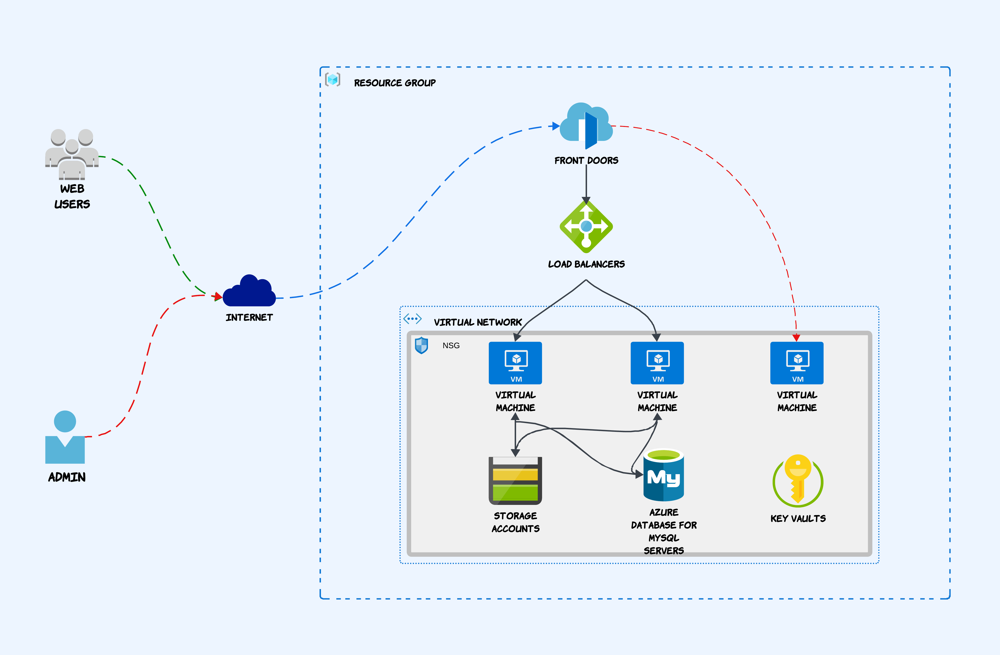

# Part 1: Shared Hosting Platform Architecture

We’ll start by exploring the Azure infrastructure that forms the backbone of our hosting platform. I’ll explain the architectural design, the resources involved, and the key decisions made to ensure a secure and scalable environment.

## Architecture Overview
This architecture is based on the **Hub-and-Spoke Model**.

**Hub**: It contains shared Azure resources/services that spoke networks can utilize. It includes a Bastion Host, Azure Front Door, Azure NetApp Files, and Key Vault.

**Spoke**: The spokes are individual VNets that connect to the hub. Each spoke can represent a different environment:
- **Production environment VNet**: Resources for live applications.
- **Preproduction environment VNet**: Resources for staging and quality assurance.

### Key Benefits:
- **Isolation and Security**: Each spoke network is isolated, reducing the risk of lateral movement in case of a security breach.
- **Centralized Management**: Easier to manage and maintain network policies, firewalls, and monitoring in a single hub.
- **Scalability**: Simplifies adding new VNets (spokes) to the architecture without impacting existing ones.
- **Cost Efficiency**: Allows shared services to be centralized, reducing redundancy and cost.

## Resource Considerations

### Traffic Management & Security
- **Azure Front Door** handles incoming web traffic, providing load balancing, SSL offloading, and Web Application Firewall (WAF) capabilities. It ensures efficient routing based on URL paths.
- **Azure Load Balancer** distributes requests across multiple web servers to ensure high availability and scalability.
- **Network Security Group (NSG)** controls inbound and outbound traffic. Only ports 80 (HTTP) and 443 (HTTPS) are open to the internet.

### Compute & Storage
- **Web Servers**: Two Ubuntu 24.04 virtual machines (VMs) host the application using Apache. The setup allows easy scaling by adding more web servers in the future.
- **Persistent Storage**: Azure NetApp Files is used for high-performance, shared storage across web servers, supporting real-time read/write access.
- **Managed Database**: Azure Database for MySQL provides a highly available, scalable, and fully managed database service, including built-in backups.

### Security & Secrets Management
- **Azure Key Vault** securely manages secrets, encryption keys, and SSL certificates, which are accessed by Azure Front Door for secure HTTPS traffic.

### Network Isolation
All backend components (VMs, Database, Storage, Key Vault) reside within a Virtual Network (VNet) to ensure secure communication while being protected from the public internet.

## Data Flow
1. Users access the application over the internet.
2. Azure Front Door routes traffic to the Azure Load Balancer.
3. The Load Balancer distributes traffic across the web servers.
4. The Apache web servers serve application files stored on Azure NetApp Files.
5. The application interacts with Azure Database for MySQL for database operations.

This architecture ensures high availability, scalability, and security while leveraging Azure’s managed services for efficient hosting.

🚀 Stay tuned for the next part, where we’ll dive into Terraform for Infrastructure Deployment!